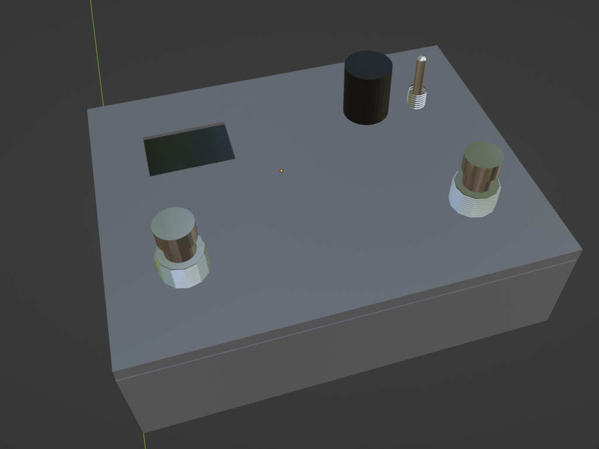

# Arduino Midi Controller Pedalboard

Arduino MIDI Foot Controller for Guitarists.

This is an Arduino-based MIDI controller designed specifically for guitarists. It features two pedal switches that can be used for controlling effects and other parameters in MIDI devices, making it a great tool for guitarists who use effects with their playing.

While this controller was designed to control Amplitube 5, it can be used to control any MIDI device, making it a versatile tool for any musician who uses MIDI in their setup.

The controller has only two foot switches to keep its cost low (mainly due to the aluminum box), but it can be relatively easily extended to more switches.

The controller sports two function modes and one programming mode.

## Function Mode

It runs the selected function mode.

### Live

In this mode, an action on the left foot switch, right foot switch, or rotary encoder triggers the controller to send a Midi _Program Change_ command to the selected bank.

- The left foot switch selects the previous program within the bank; if the current program is the first in the bank, it selects the last one.
- The right foot switch selects the next program within the bank; if the current program is the last one in the bank, it selects the first one.
- The rotary encoder selects the previous/next bank while keeping the selection within the bank unchanged. For example, if the second program was selected within the bank and the encoder is rotated one step clockwise, the new selection would be the second program in the next bank.

### Looper (To-do)

In this mode, an action on the left or right foot switch triggers a Midi _Control Change_ command.

- The left foot switch cyclically sends Record/Overwrite/Play to Bank 1
- The right foot switch cyclically Record/Overwrite/Play to Bank 2

## Program mode

The user can configure the controller via the rotary encoder:

- Rotation: Navigate to next/previous item.
- Push: Confirm the current selection. The selection is immediately saved in EEPROM.

### The menu

    Mode
        Live
        Looper
    Live Programs
        4
        6
        8
    Looper Type
        Record/Overwrite/Play
        Record/Play/Overwrite
    Looper Command
        0x50
        0x51
        0x52

## Software

- Visual Studio Code
- PlatformIO extension

### Libraries

- [Adafruit_SSD1306](https://github.com/adafruit/Adafruit_SSD1306) by Adafruit
- [SoftwareSerial](http://arduiniana.org/libraries/newsoftserial/)
- [ec11.hpp](http://github.com/aleh/a21) by Aleh Dzenisiuk
- [Bounce2.h](https://github.com/thomasfredericks/Bounce2) by Thomas Ouellet Fredericks

### Directory Structure

The structure is as per PlatformIO project template.

    /
    |-- docs/
    |   |-- Arduino Midi Controller - Schematic.svg
    |   |-- Arduino Midi Controller - Wiring.svg
    |   |-- Arduino Midi Controller.blend
    |   |-- BOM.md
    |-- include/
    |-- lib/
    |-- scripts/  # PlatformIO scripts
    |-- src/
    |-- test/

## Hardware

See [docs/BOM.md](docs/BOM.md)

## Credits

Feel free to modify and distribute this project under the terms of the MIT license. Please credit the original author if you do so.
